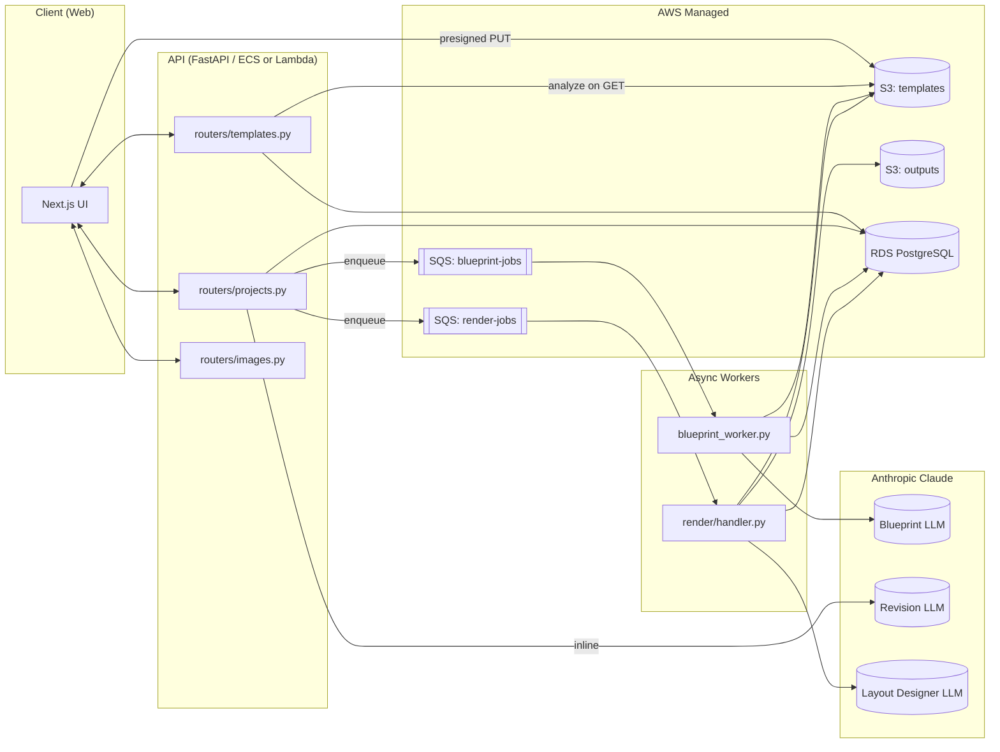
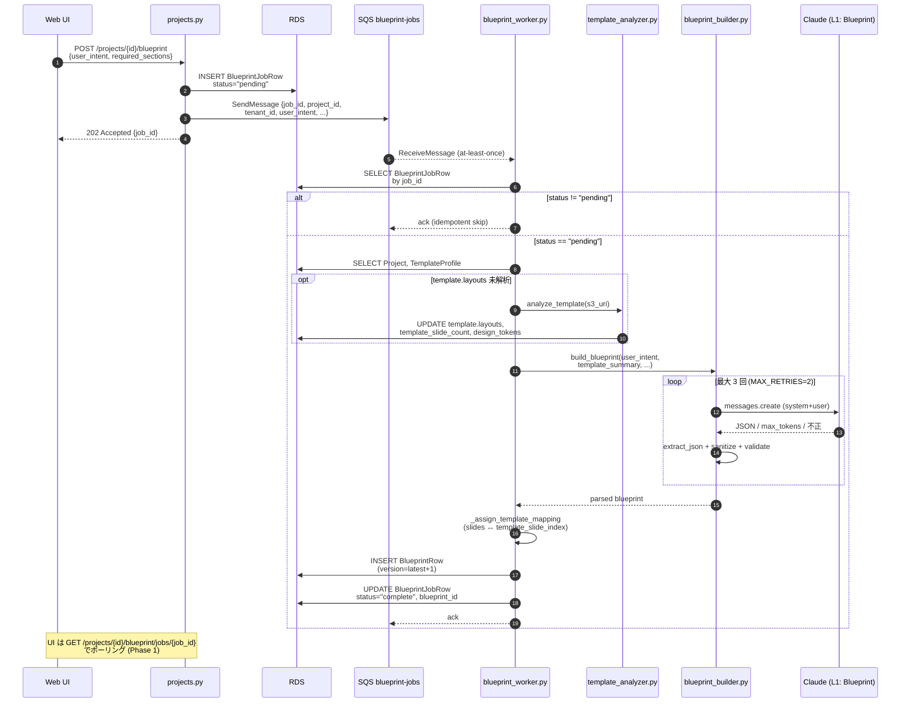
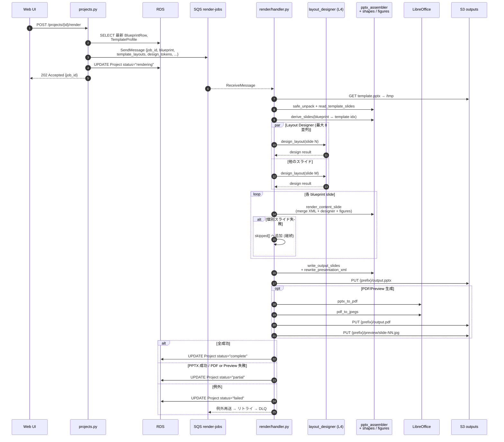
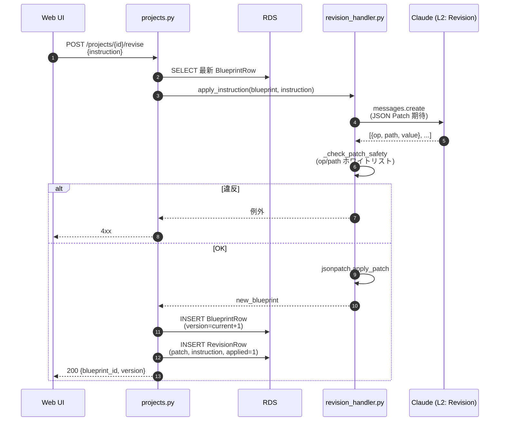
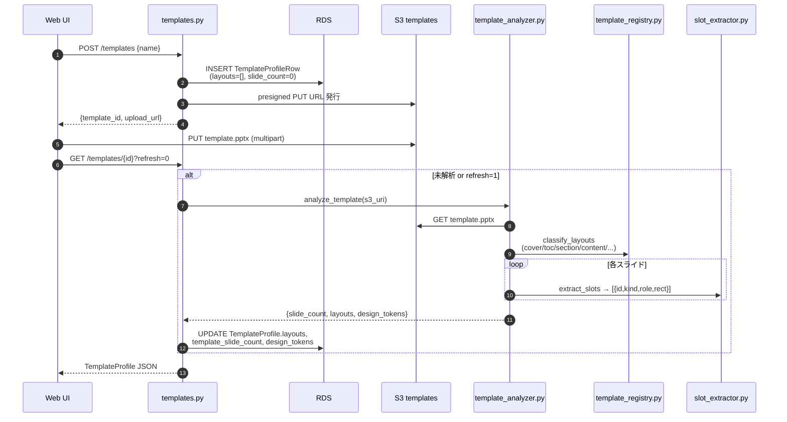
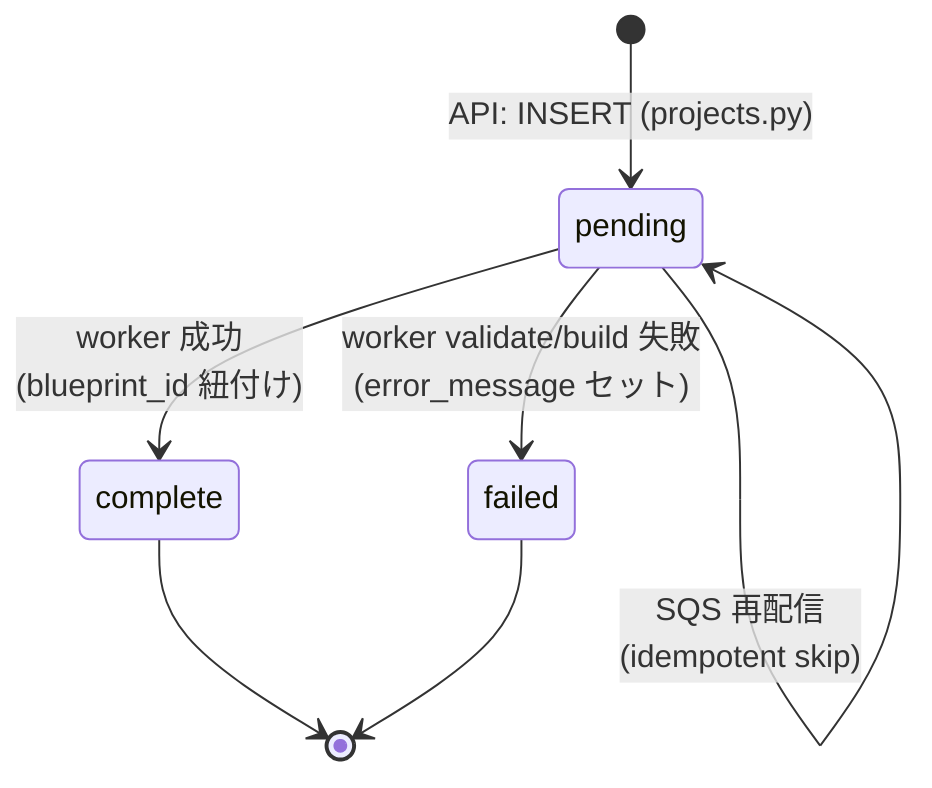
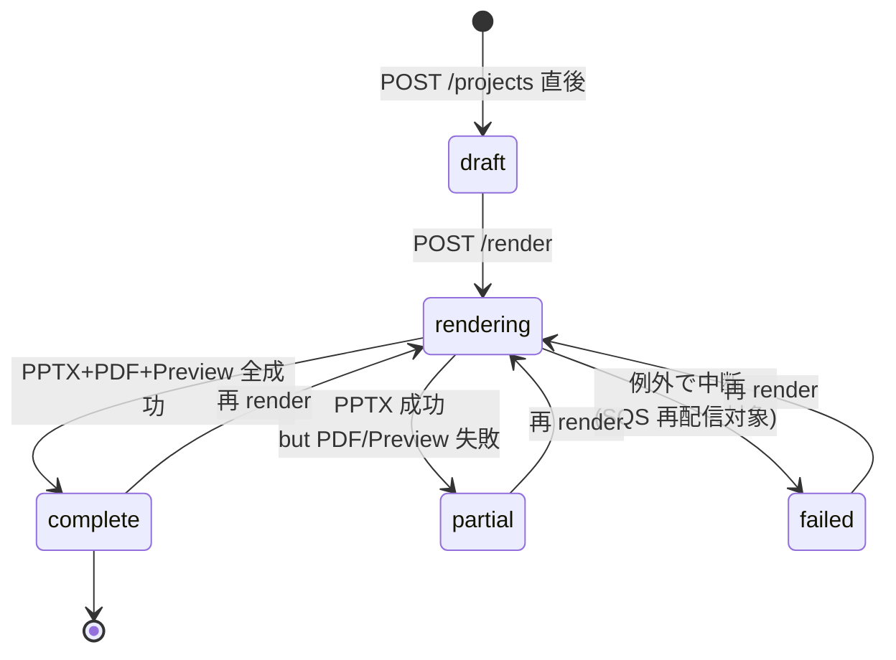

# 08. 実装フロー / Implementation Flow

## 目的とスコープ

本書は SlideForge の **実装層 (Phase 1)** におけるエンドツーエンドの処理フローを Mermaid 図で可視化し、
- API 受信 → DB → LLM → レンダリング → S3 保存 までの呼び出し順序
- 主要ジョブ (`BlueprintJob`, `Project` の render ステータス) の状態遷移
- エラーハンドリング/リトライの境界
を明示することを目的とする。

高レベルのコンポーネント責務は `SlideForge_概要設計書.md §4`、LLM 呼び出し設計は `01_prompt_engineering.md`、Phase 2 拡張は `07_phase2_design.md` を参照。本書は **コードに対する実装ビュー** を提供する。

参照対象コミット時点の主要ファイル:

| 役割 | ファイル |
| --- | --- |
| HTTP API ルータ | `app/api/routers/projects.py`, `app/api/routers/templates.py` |
| Blueprint 非同期ワーカ | `app/api/blueprint_worker.py` |
| Render Lambda ハンドラ | `app/render/handler.py` |
| ビジネスロジック | `app/api/services/{blueprint_builder,revision_handler,template_analyzer,template_registry,llm,queue,storage}.py` |
| DB ステータス更新 (psycopg2 直叩き) | `app/render/db_status.py` |
| ORM モデル | `app/api/models/db.py` |

---

## 1. システム全体俯瞰

主要コンポーネントとデータの流れ。SQS で API と非同期ワーカ (Blueprint / Render) が分離されている点が Phase 1 の前提。

---

## 2. Blueprint 生成フロー (非同期)

`POST /api/projects/{project_id}/blueprint` をトリガとした骨格生成パイプライン。HTTP 応答は 202 で即返り、後段は SQS 経由でワーカが処理する。

**主要参照点**: `projects.py:209-256` (受信), `blueprint_worker.py:60-167` (本体), `blueprint_builder.py:40-61` (LLM リトライ), `template_analyzer.py:158-199` (テンプレ解析)。

---

## 3. Render フロー (非同期)

`POST /api/projects/{project_id}/render` で `.pptx` / `.pdf` / `preview/*.jpg` を S3 に書き出す。Layout Designer LLM (L4) はコンテンツスライド毎に並列発火する。

**主要参照点**: `projects.py:409-461` (受信), `handler.py:71-486` (本体), `db_status.py:23-104` (psycopg2 直接 UPDATE)。Project の status は ORM ではなく `db_status.py` 経由で更新される (Lambda のコールドスタート短縮目的)。

---

## 4. Revision フロー (同期 / インライン)

修正指示 (L2) は **HTTP リクエストスレッド上で同期実行** され、JSON Patch (RFC 6902) を生成・適用して新バージョンの `BlueprintRow` を作る。SQS は経由しない。

**注意**: LLM 呼び出しが HTTP 応答時間に直結する。長文指示は API Gateway / ALB のタイムアウト (典型 30s) を超えるリスクがある。Phase 2 では非同期化候補。

**主要参照点**: `projects.py:343-406`, `revision_handler.py:23-50`。

---

## 5. テンプレート登録 / 解析フロー

登録は presigned PUT で先にレコードと URL を作成し、解析は **GET 時遅延実行** または Blueprint ワーカ起動時に実行される (どちらが先でも同じ結果)。

**主要参照点**: `templates.py:49-109`, `template_analyzer.py:158-199`, `template_registry.py:43-54`, `render/slot_extractor.py`。

---

## 6. ジョブ状態遷移図

### 6.1 BlueprintJob

`BlueprintJobRow.status` は単純な3状態。SQS 再配信は `pending` 以外なら no-op で吸収する (`blueprint_worker.py:68-71`)。

| 終端状態 | トリガ | 残置データ |
| --- | --- | --- |
| `complete` | `BlueprintBuildError` 以外で正常終了 | `blueprint_id` が新規 BlueprintRow を指す |
| `failed` | `BlueprintBuildError` / project 消失 / template 消失 | `error_message` (≤2000 文字) |

**transient 例外** (DB 接続断, Secrets Manager, Anthropic transport) は再 raise され、SQS が再配信 → 規定回数で DLQ へ。アプリ側はリトライ回数を持たない。

### 6.2 Project (render ステータス)

`ProjectRow.status` は draft 状態を含めた5状態。`render` 実行中以降は `db_status.py` から psycopg2 直 UPDATE される。

| 状態 | 観測ポイント | UI 取り扱い |
| --- | --- | --- |
| `draft` | ブループリント未生成も含む | render ボタン無効 |
| `rendering` | SQS 投入後 〜 Lambda 完了前 | スピナー / ポーリング |
| `complete` | `output.pptx`, `output.pdf`, `preview/*.jpg` 揃う | DL 全種類有効 |
| `partial` | `output.pptx` のみ揃う (PDF/Preview 失敗) | PPTX のみ DL、警告表示 |
| `failed` | Lambda 例外 → DB 更新 | 再 render を促す |

### 6.3 TemplateProfile

明示的 status カラムは無く、`template_slide_count == 0` を「未解析」のセンチネルとして扱う。`layouts` の有無で再解析を判定する (`blueprint_worker.py:96`)。

---

## 7. エラーハンドリング / リトライ境界

| シナリオ | コード位置 | 方針 |
| --- | --- | --- |
| Blueprint LLM 出力検証失敗 | `blueprint_builder.py:40-61` | アプリ内で最大 3 回試行 (MAX_RETRIES=2)、失敗時 `BlueprintBuildError` |
| LLM `stop_reason==max_tokens` | `blueprint_builder.py:53-57` | リトライしても改善しないため即座に終端エラー |
| Blueprint ワーカ中の transient 例外 | `blueprint_worker.py:154-159` | rollback して raise → SQS が再配信 → 既定回数超で DLQ |
| Blueprint ワーカ idempotency | `blueprint_worker.py:68-71` | `status != "pending"` なら処理スキップ (at-least-once 対策) |
| Render 個別スライド失敗 | `handler.py:434-444` | 当該スライドはテンプレ XML をそのまま採用、`skipped[]` に記録、処理継続 |
| Render PDF/Preview 失敗 | `handler.py:481-486` | 例外を握り潰し `partial` でクローズ、PPTX は配信 |
| Render 例外 (本体不可) | `handler.py:99-106` | DB を `failed` にして例外再送 → SQS リトライ → DLQ |
| Revision Patch 安全性 | `revision_handler.py:45` | op/path のホワイトリスト違反は適用前に拒否 |
| SQS 可視性タイムアウト・DLQ 設定 | `infra/stacks/app_stack.py` | アプリコードでなく CDK 定義側で持つ |

---

## 8. データ受け渡しサマリ

| ペイロード | 主なキー | 概算サイズ |
| --- | --- | --- |
| Blueprint job (SQS) | `job_id, project_id, tenant_id, user_intent, required_sections, aux_context` | ~1KB |
| Render job (SQS) | `job_id, tenant_id, project_id, template_s3, blueprint, template_layouts, design_tokens, out_prefix` | 5–50 KB |
| Blueprint オブジェクト (DB) | `title, slides[].{index, layout, figure_type, content.slots, template_slide_index, ...}` | 1–50 KB |
| Revision Patch (DB) | RFC 6902 配列 `[{op, path, value}, ...]` | ~1 KB / リビジョン |

SQS 1メッセージ上限 (256KB) に対して Render ペイロードは余裕があるが、design_tokens に画像 base64 等を入れると逼迫するため文字列配色トークンに限定している (`07_phase2_design.md §3` 参照)。

---

## 9. 関連ドキュメント

- `SlideForge_概要設計書.md`: 高レベルアーキテクチャ・コンポーネント責務
- `01_prompt_engineering.md`: LLM 呼び出し L1〜L6 の入出力契約
- `03_ops_and_testing.md`: CI/CD・監視・SLO
- `04_template_and_plugin.md`: テンプレ解析と図表プラグイン IF
- `07_phase2_design.md`: Slot/レンダリングの将来拡張
- `visual_qa_workflow.md`: PPTX→PNG 経由のビジュアル QA フロー
